### 前言
两台计算机是如何通信呢？在成千上万的计算机中，为什么一台计算机能够准确着寻找到另外一台计算机，并且把数据发送给它呢？

下面是网络通信的五层模型

### 物理层
一台计算机与另一台计算机要进行通信，首先是要把这台计算机与另外的其他计算机连起来，这样，才能把数据传输过去。例如可以通过光纤，电缆，双绞线等介质把他们连接起来，然后再进行通信。

也就是说，物理层负责把两台计算机连起来，然后在计算机之间通过高低电频来传送0,1这样的电信号。

### 数据链路层
物理层只是单纯着负责把计算机连接起来，并且在计算机之间传输0，1这样的电信号。如果这些0，1组合的传送毫无规则的话，计算机是解读不了的。因此，我们需要制定一套规则来进行0，1的传送。例如多少个电信号为一组啊，每一组信号应该如何标识才能让计算机读懂啊等等。于是，有了以太网协议。
##### 以太网协议
以太网协议规定，一组电信号构成一个数据包，我们把这个数据包称之为帧。每一个桢由标头(Head)和数据(Data)两部分组成。

帧的大小一般为 64 - 1518 个字节。假如需要传送的数据很大的话，就分成多个桢来进行传送。

对于表头和数据这两个部分，他们存放的都是一些什么数据呢？毫无疑问，我们至少得知道这个桢是谁发送，发送给谁的等这些信息，所以头部主要是一些说明数据，例如发送者，接收者等信息。而数据部分则是这个数据包具体的，想给接守者的内容。

一个桢的长度是 64~1518 个字节，也就是说桢的长度不是固定的，但为了知道头部是几个字节，数据部分是几个字节呢。所以协议把头部的字节固定，并且为18个字节。

把一台计算的的数据通过物理层和链路层发送给另一台计算机，究竟是谁发给谁的，计算机与计算机之间如何区分，你总得给他们一个唯一的标识吧？于是，MAC 地址出现了。
##### MAC 地址
连入网络的每一个计算机都会有网卡接口，每一个网卡都会有一个唯一的地址，这个地址就叫做 MAC 地址。计算机之间的数据传送，就是通过 MAC 地址来唯一寻找、传送的。MAC地址 由 48 个字节所构成，在网卡生产时就被唯一标识了。
##### 广播与ARP协议
* 广播

如图，假如计算机 A 知道了计算机 B 的 MAC 地址，然后计算机 A 想要给计算机 B 传送数据，虽然计算机 A 知道了计算机 B 的 MAC 地址，可是它要怎么给它传送数据呢？计算机 A 不仅连着计算机 B，而且计算机 A 也还连着其他的计算机。虽然计算机 A 知道计算机 B 的 MAC 地址，可是计算机 A 却不知道知道计算机 B 是分布在哪边路线上，为了解决这个问题，于是，有了广播的出现。

在同一个子网中，计算机 A 要向计算机 B 发送一个数据包，这个数据包会包含接收者的 MAC 地址。当发送时，计算机 A 是通过广播的方式发送的，这时同一个子网中的计算机 C, D 也会收到这个数据包的，然后收到这个数据包的计算机，会把数据包的 MAC 地址取出来，与自身的 MAC 地址对比，如果两者相同，则接受这个数据包，否则就丢弃这个数据包。这种发送方式我们称之为广播, 就像我们平时在广场上通过广播的形式呼叫某个人一样，如果这个名字是你，你就理会一下，如果不是你，你就当作听不见。

* *ARP 协议
那么，计算机 A 是如何知道计算机 B 的 MAC 地址的呢？这个时候就得由 ARP 协议这个家伙来解决了，不过 ARP 协议会涉及到IP地址，我们到网络层才会说IP地址。

### 网络层
实际上我们所处的网络，是由无数个子网络构成的。广播的时候，也只有同一个子网里面的计算机能够收到。

假如没有子网这种划分的话，计算机 A 通过广播的方式发一个数据包给计算机 B , 其他所有计算机也都能收到这个数据包，然后进行对比再舍弃。世界上有那么多计算机，每一台计算机都能收到其他所有计算机的数据包，就会导致奔溃，因此产生了子网。

那么如何区分 MAC 地址是属于同一个子网的呢？假如是同一个子网，那我们就用广播的形式把数据传送给对方，如果不是同一个子网的，我们就会把数据发给网关，让网关进行转发。网关是指网间连接器、协议转换器。为了解决这个问题，于是有了 IP 协议。

##### IP协议
IP协议，它所定义的地址，我们称之为IP地址。IP协议有两种版本，一种是 IPv4,另一种是 IPv6。

这个 IP 地址由 32 位的二进制数组成，我们一般把它分成4段的十进制表示，地址范围为0.0.0.0~255.255.255.255。

每一台想要联网的计算机都会有一个IP地址。这个IP地址被分为两部分，前面一部分代表网络部分，后面一部分代表主机部分。并且网络部分和主机部分所占用的二进制位数是不固定的。

假如两台计算机的网络部分是一模一样的，我们就说这两台计算机是处于同一个子网中。例如 192.168.43.1 和 192.168.43.2, 假如这两个 IP 地址的网络部分为 24 位，主机部分为 8 位。那么他们的网络部分都为 192.168.43，所以他们处于同一个子网中。

但是网络部分是占几位，主机部分又是占几位呢？也就是说，单单从两台计算机的IP地址，我们是无法判断他们的是否处于同一个子网中的。这就引申出了另一个关键词————**子网掩码**。子网掩码和IP地址一样也是 32 位二进制数，不过它的网络部分规定全部为 1，主机部分规定全部为 0。也就是说，假如上面那两个IP地址的网络部分为 24 位，主机部分为 8 位的话，那他们的子网掩码都为 11111111.11111111.11111111.00000000，即255.255.255.0。

知道了子网掩码，相当于我们知道了网络部分是几位，主机部分是几位。我们只需要把 IP 地址与它的子网掩码做与(and)运算，然后把各自的结果进行比较就行了，如果比较的结果相同，则代表是同一个子网，否则不是同一个子网。

例如，192.168.43.1和192.168.43.2的子码掩码都为255.255.255.0，把IP与子码掩码相与，可以得到他们都为192.168.43.0，进而他们处于同一个子网中。

##### ARP协议
假如两台计算机处于同一个子网之中，计算机A要给计算机B发送数据时。我们可以通过ARP协议来得到计算机B的MAC地址。

ARP协议也是通过广播的形式给同一个子网中的每台电脑发送一个数据包(当然，这个数据包会包含接收方的IP地址)。对方收到这个数据包之后，会取出IP地址与自身的对比，如果相同，则把自己的MAC地址回复给对方，否则就丢弃这个数据包。这样，计算机A就能知道计算机B的MAC地址了。

知道了MAC地址之后，发送数据是通过广播的形式发送，询问对方的MAC地址也是通过广播的形式来发送，那其他计算机怎么知道你是要传送数据还是要询问MAC地址呢？其实在询问MAC地址的数据包中，在对方的MAC地址这一栏中，填的是一个特殊的MAC地址，其他计算机看到这个特殊的MAC地址之后，就能知道广播想干嘛了。

假如两台计算机的IP不是处于同一个子网之中，这个时候，我们就会把数据包发送给网关，然后让网关让我们进行转发传送

##### DNS服务器
我们是如何知道对方计算机的IP地址的呢？这个问题可能有人会觉得很白痴，心想，当然是计算机的操作者来进行输入了。这没错，当我们想要访问某个网站的时候，我们可以输入IP来进行访问，但是我相信绝大多数人是输入一个网址域名的，例如访问百度是输入 www.baidu.com 这个域名。其实当我们输入这个域名时，会有一个叫做DNS服务器的家伙来帮我们解析这个域名，然后返回这个域名对应的IP给我们的。

综上，网络层的功能就是让我们在茫茫机海中，能够找到另一台计算机在哪里，是否属于同一个子网等。

### 传输层
通过物理层、数据链路层以及网络层的互相帮助，我们已经把数据成功从计算机A传送到计算机B了，可是，计算机B里面有各种各样的应用程序，计算机该如何知道这些数据是给谁的呢？

这是由端口来完成的，也就是说，我们在从计算机A传数据给计算机B的时候，还得指定一个端口，以供特定的应用程序来接受处理。传输层的功能就是建立端口到端口的通信。相比网络层的功能是建立主机到主机的通信。

只有有了IP和端口，我们才能进行准确着通信。这些端口信息也会包含在数据包里的。

传输层最常见的两大协议是 TCP 协议和 UDP 协议，其中 TCP 与 UDP 最大的不同就是 TCP 提供可靠的传输，而 UDP 提供的是不可靠传输。

### 应用层
应用层是最接近我们用户了。虽然我们收到了传输层传来的数据，可是这些传过来的数据五花八门，有html格式的，有mp4格式的，各种各样。因此我们需要指定这些数据的格式规则，收到后才能进行解包。

### 总结
强烈推荐《计算机网络：自顶向下》这本书。