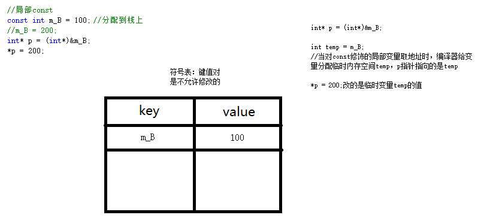

@[TOC](C++)

# C++
## 1. C++ 初识
### 1.1 C++ 概述
C++ 语言在 C 语言的基础上添加了**面向对象编程（OOP）**和**泛型编程**的支持，C 语言是面向过程的语言。
1. C++ 是 C 语言的加强，是一种更好的 C 语言；
2. C++ 是以 C 语言为基础的，并且完全兼容 C 语言的特性；

C 语言第一个标准 C89，C++ 第一个标准 C++98。

第一个 C++ 程序
```cpp
#define _CRT_SECURE_NO_WARNINGS //防止 C4996 错误                       
#include<iostream>	//标准输入输出流，相当于 C 语言的 stdio.h
using namespace std;	//使用 命名空间 标准
//#include<time.h>
//#include<ctime>
//#include<math.h>
//#include<cmath>
int main()
{
	// cout 标准输出流对象
	// << 用于在 cout 后拼接输出的内容
	//endl --end line，刷新缓冲区，并换行
	cout << "hello world" << endl;
	system("pause");
	return EXIT_SUCCESS;
}
```
### 1.2 面向对象和面向过程
面向对象程序设计和面向过程程序设计的区别实际就是解决问题的方式不同。
+ 面向对象：分析解决问题的步骤，然后通过函数一步一步的实现，解决的时候的一个一个调用。
+ 面向对象：把事物抽象成对象的概念，然后赋予给对象一些属性和方法，让每个对象去执行自己的方法。

#### 1.2.1 举例
    洗衣机里的脏衣服怎么洗干净？

    面向过程：执行加洗衣粉的方法—>执行放洗涤剂的方法—>执行加水的方法—>执行放衣服的方法—>执行清洗的方法—>执行烘干的方法；拆分成一个个方法，是没有对象去调用的。通过一个个方法的执行解决问题。
    面向对象：先添加洗衣机对象和人对象
        洗衣机：加一些属性和方法—洗衣服方法，烘干方法
        人：加洗衣粉方法，加水方法，放衣服方法
        人.加水；人.加洗衣粉；洗衣机.洗衣服；洗衣机.烘干
        ——先抽象出对象，然后用对象执行方法的方式解决问题。

#### 1.2.2 区别
**蛋炒饭和盖浇饭的区别**

蛋炒饭的好处就是入味均匀，吃起来香。但如果恰巧你不爱吃鸡蛋，只爱吃青菜的话，那么唯一的办法就是全部倒掉，重新做一份青菜炒饭了。而盖浇饭就没这么多麻烦，你只需要把上面的盖菜去掉，更换一份盖菜就可以了。盖浇饭的缺点是入味不均，可能没有蛋炒饭那么香。如果从个人的角度看，大家都不是美食家，没那么多讲究；如果从饭馆角度来讲的话，做盖浇饭显然比蛋炒饭更有优势，他可以组合出来任意多的组合，而且不会浪费。  

盖浇饭的好处就是“菜”“饭”分离，从而提高了制作盖浇饭的灵活性。饭不满意就换饭，菜不满意换菜。用软件工程的专业术语就是**可维护性**比较好，“菜”和“饭”的**耦合度**比较低。蛋炒饭将“蛋”和“饭”搅和在一起，想换“蛋”和“饭”中任何一种都很困难，耦合度很高，以至于“可维护性”比较差。<u>软件工程追求的目标之一就是可维护性，可维护性主要表现在3个方面：可理解性、可测试性和可修改性。面向对象的好处之一就是显著的改善了软件系统的可维护性。</u>

#### 1.2.3 特点
**面向过程：**

**程序 = 数据结构 + 算法**

优点：性能高，因为类调用时需要实例化，开销比较大，比较消耗资源——单片机、嵌入式开发、Linux/Unix等一般采用面向过程开发；

缺点：没有面向对象易维护、易复用、易扩展。

**面向对象：**

**对象 = 算法 + 数据结构**

**程序 = 对象 + 对象 + ……**

优点：易维护、易复用、易扩展；由于面向对象有**封装、继承、多态**的特性，可以设计出低耦合的系统，使系统更加灵活、更易于维护；

缺点：性能比面向过程低。

+ 封装
  把客观事物封装成抽象的类，并且类可以把自己的数据和方法只让可信的类或者对象操作，对不可信的进行信息隐藏
  类将成员变量和成员函数封装在类的内部，根据需要设置访问权限，通过成员函数管理内部状态。
+ 继承
  继承所表达的是类之间相关的关系，这种关系使得对象可以继承另外一类对象的特征和能力。
  继承的作用：避免公用代码的重复开发，减少代码和数据冗余。
+ 多态
  多态性可以简单地概述为“一个接口，多种方法”，字面意思为多种形态。程序在运行时才决定调用的函数，它是面向对象编程领域的核心概念。

## 2. C++ 语法
### 2.1 :: 作用域运算法
:: 代表作用域，如果前面什么都不加，代表全局作用域
```cpp
std::cout<< ::a << std::endl 
```

### 2.2 namespace 命名空间
1、 命名空间用途：解决名称冲突；

2、 命名空间下可以放**变量、函数、结构体、类……**；

3、 命名空间必须要申明在全局的作用域下，不可以命名到局部作用域下；
```cpp
void test()
{
    namespace B{
        //这个是错误的
    }
}
```
4、 命名空间可以嵌套命名空间
```cpp
// B 命名空间下的 C 命名空间下的变量 m
cout << B::C::m << endl;
```
5、 命名空间是开放的，可以随时给命名空间添加新的成员；
```cpp
namespace{
    int a = 10;
}
namespace{
    int b = 20;
}
```
6、 命名空间是可以匿名的，相当于全局作用下的变量；
```cpp
namespace{
    int m_A = 10;
    int m_B = 20;
    //当写的命名空间是匿名的，相当于写了 static m_A, static m_B
}
cout << m_A << endl;
cout << :: m_B << endl;
```
7、 命名空间可以写别名；
```cpp
namespace veryLongName{
    int a = 10;
}
void test()
{
    namespace veryLongName = veryShortName;
    cout << veryShortName::a << endl;
    cout << veryLongName::a << endl;
}
```
### 2.3 using声明以及using编译指令
1、 using声明

当using声明与就近原则同时出现，就会报错，尽量避免；

2、 using编译指令

当using编译指令与就近原则同时出现时，优先使用就近原则；

当using编译指令有多个，需要加作用域区分；


```cpp
#define _CRT_SECURE_NO_WARNINGS
#include<iostream>
using namespace std;

namespace KingGlory
{
	int suwukongId = 1;
}
namespace LOL
{
	int suwukongId = 3;
}

void test01()
{
	//int suwukongId = 2;
	//1、using声明
	using KingGlory::suwukongId;
	//当using声明与就近原则同时出现，就会报错，尽量避免
	cout << suwukongId << endl;
}

void test02()
{
	int suwukongId = 2;
	//2、using编译指令
	using namespace KingGlory;
	using namespace LOL;
	//当using编译指令与就近原则同时出现时，优先使用就近原则
	//当using编译指令有多个，需要加作用域区分
	cout << suwukongId << endl;

}
int main()
{
	test01();
	test02();
	system("pause");
	return EXIT_SUCCESS;
}
```
### 2.4 C++ 相对 C 语言的增强及扩展
1、全局变量检测增强 C++检测出重定义；

2、函数检测增强：返回值检测、形参类型检测、函数调用参数个数检测；

3、类型转换检测增强：C++ 下必须强制转换成等号左右两侧一致的类型；

4、struct增强：①C++语言下的结构体可以有函数创建结构体变量；②可以简化关键字 struct；

5、bool类型扩展：C语言下没有这个类型，C++有bool类型，代表真假，sizeof(bool) = 1;

6、三目运算符增强：C语言下返回的是值；C++下返回的是变量

7、const增强：C++下称为常量；C语言下称为伪常量
+ C语言下
  全局const，直接修改 失败；间接修改 语法通过，运行失败

  局部const，直接修改 失败；间接修改 成功
+ C++下
  全局const，和C结论一样

  局部const，直接修改 失败；间接修改 语法通过，运行成功，但修改失败

```cpp
#define _CRT_SECURE_NO_WARNINGS
#include<iostream>
using namespace std;

//1、全局变量检测增强 C++检测出重定义
int a;
//int a = 10;

//2、 函数检测增强 返回值检测 形参类型检测	函数调用参数个数检测
int getRectS(int w, int h)
{
	return w * h;
}
void test01()
{
	printf("%d\n", getRectS(10, 10));
}

//3、 类型转换检测增强
void test02()
{
	char* p = (char*)malloc(64);
}

//4、struct增强 C++语言下的结构体可以有函数		创建结构体变量，可以简化关键字 struct
struct Person {
	int age;
	void func()
	{
		age++;
	}
};
void test03()
{
	Person p;
	p.age = 100;
	p.func();
	cout << "p的age = " << p.age << endl;
}

//5、bool类型扩展 C语言下没有这个类型 C++有bool类型
bool flag = true;	//bool类型代表真和假  true false
void test04()
{
	cout << sizeof(bool) << endl;	//bool类型只占一个字节
	//flag = false;
	//flag = 100;	//将非0的数都转换为真
	cout << flag << endl;
}

//6、三目运算符增强
void test05()
{
	int a = 10;
	int b = 20;
	printf("ret = %d\n", a > b ? a : b);
	a > b ? a : b = 100;	//C++下返回的是变量 b
	printf("a=%d\n", a);
	printf("b=%d\n", b);
}

//7、const增强
//全局const
const int m_A = 100;	//受常量区保护，运行时修改失败，和C语言一样
void test06()
{
	//m_A = 200;
	//int* p = (int*)&m_A;
	//*p = 200;

	//局部const
	const int m_B = 100;	//分配到栈上
	//m_B = 200;
	int* p = (int*)&m_B;
	*p = 200;
	cout << "m_B = " << m_B << endl;

	int arr[m_B];	//在C++下，const 是常量，可以初始化数组
}

int main()
{
	test01();
	test03();
	test04();
	test05();
	test06();
	return 0;
}
```
```c
#define _CRT_SECURE_NO_WARNINGS
#include<stdio.h>

//1、全局变量检测增强
int a;
int a = 10;

//2、 函数检测增强 返回值没有检测 形参类型没有检测	函数调用参数个数没有检测
getRectS(w, h)
{
	return w * h;
}
void test01()
{
	printf("%d\n", getRectS(10, 10, 10));
}

//3、 类型转换检测增强
void test02()
{
	char* p = malloc(64);
}

//4、struct增强
struct Person {
	int age;
	//void func();	C语言下的结构体不可以有函数
};
void test03()
{
	struct Person p;	//创建结构体变量的时候必须加关键字
	p.age = 100;
}

//5、bool类型扩展 C语言下没有这个类型
//bool a;

//6、三目运算符增强
void test05()
{
	int a = 10;
	int b = 20;
	printf("ret = %d\n", a > b ? a : b);
	//a > b ? a : b = 100;	//C语言下 返回的是值 20
	*(a > b ? &a : &b) = 100;
	printf("a=%d\n", a);
	printf("b=%d\n", b);
}

//7、const增强
//全局const
const int m_A = 100;	//受常量区保护，运行时修改失败
void test06()
{
	//m_A = 200;
	//int* p = &m_A;
	//*p = 200;

	//局部const
	const int m_B = 100;	//分配到栈上
	//m_B = 200;
	int* p = &m_B;
	*p = 200;
	printf("%d\n", m_B);

	//int arr[m_B];	//在C语言下，const 是伪常量，不可以初始化数组
}

int main()
{
	test01();
	test05();
	test06();
	return 0;
}
```
