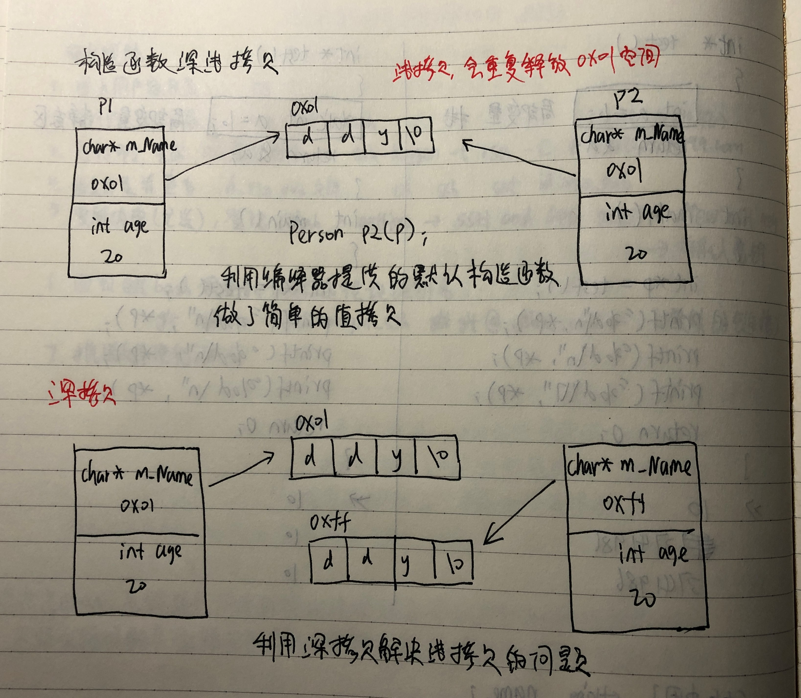
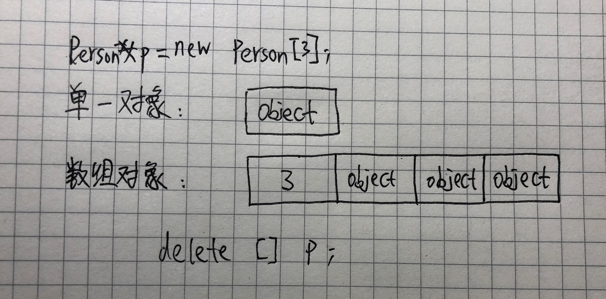
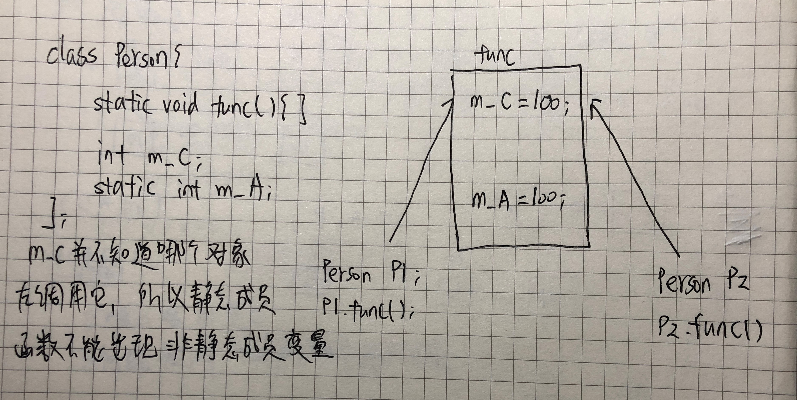

# C++
### 3.3 对象的构造和析构
在 C++ 中，当我们创造对象的时候，这个对象应该有一个初始状态，当对象销毁之前，应该销毁自己创建的一些数据。对象的初始化和清理也是两个非常重要的安全问题，一个变量或者对象没有初始化，对其使用后果是未知的；同样使用完一个变量，没有及时清理，也会造成一定的安全问题。C++ 给我们提供了解决方案：**构造函数和析构函数**，这两个函数将会被编译器自动调用，完成对象的初始化和对象清理工作。**即使你不提供初始化操作和清理操作，编译器也会给你增加默认操作，只是这个默认初始化操作不会做任何事情，相当于空函数。**  

**构造函数：**  
* 构造函数必须声明在全局作用域下；  
* 没有返回值，不用写 void ；  
* 函数名与类名相同；  
* 可以有参数，也可以发生重载；  
* 构造函数 由编译器自动调用一次，无需手动调用。

**析构函数：**  
* 没有返回值 不用写void；  
* 函数名与类名相同，但是在函数名前要加 ~ ；  
* 不可以有参数，不可以发生重载；  
* 析构函数也是由编译器自动调用一次，无需手动调用；  
* 只有对象在释放的时候才会执行。  

```cpp
#define _CRT_SECURE_NO_WARNINGS
#include<iostream>
using namespace std;
class Person {
public:
	Person()
	{
		cout << "Person的构造函数调用" << endl;
	}
	~Person()
	{
		cout << "Person的析构函数调用" << endl;
	}
};
void test01()
{
	Person p;
}
int main()
{
	test01();
	return 0;
}
```
#### 3.3.1 构造函数的调用和分类
**分类**：  
* 按照参数分类：  
  * 有参构造
  * 无参（默认）构造  
* 按照类型分类：  
  * 普通构造函数  
  * 拷贝构造函数（const Person &p)  

**调用：**  
* 括号法
* 显示法
* 隐式法

>注意事项  
>>不要用括号法调用无参构造函数，编译器会将它当成函数的声明；  
>>不要用拷贝构造函数初始化匿名对象，编译器认为该操作是对象实例化，如果已经存在拷贝对象，编译器就会认为重定义；  

```cpp
#define _CRT_SECURE_NO_WARNINGS
#include<iostream>
#include<string>
using namespace std;
//构造函数分类
//按参数分类：无参构造(默认构造函数)和有参构造
//按类型分类：普通构造函数和拷贝构造函数
class Person {
public:
	Person()
	{
		cout << "Person的默认构造函数调用" << endl;
	}
	Person(int age)
	{
		m_Age = age;
		cout << "Person的有参构造函数调用" << endl;
	}
	//拷贝构造函数
	Person(const Person &p)
	{
		cout << "Person的拷贝构造函数调用" << endl;
		m_Age = p.m_Age;
	}
	//析构函数
	~Person()
	{
		cout << "Person的析构函数调用" << endl;
	}
	int m_Age;
};
//构造函数的调用
void test01()
{
	Person p;
	//1、括号法
	Person p1(10);
	Person p2(p1);
	//注意事项
	//不要用括号法，调用无参构造函数
	//Person p3();//编译器会将它当成函数的声明
	
	//2、显示法
	Person p4 = Person(10);//有参构造
	Person p5 = Person(p4);//拷贝构造
	//对象在栈上创建，符合先进后出的原则，所以先调用的是p5的析构函数，然后是p4的析构函数
	Person(10);//匿名对象 特点：当前行执行完后立即释放
	cout << "--------------" << endl;

	//注意事项二
	//不要用拷贝构造函数初始化匿名对象
	//Person(p4);//编译器认为Person p4对象实例化，如果已经有p4，p4就重定义

	//3、隐式法
	cout << "~~~~~~~~~~" << endl;
	Person p6 = 10;//Person p5 = Person(10);
	Person p7 = p6;
}
int main()
{
	/*
	Person p(18);
	Person p2(p);
	cout << "p2的年龄： " << p2.m_Age << endl;
	*/
	test01();
	return 0;
}
```
```cpp
>>Person的默认构造函数调用
>>Person的有参构造函数调用
>>Person的拷贝构造函数调用
>>Person的有参构造函数调用
>>Person的拷贝构造函数调用
>>Person的有参构造函数调用
>>Person的析构函数调用
>>--------------
>>~~~~~~~~~~
>>Person的有参构造函数调用
>>Person的拷贝构造函数调用
>>Person的析构函数调用
>>Person的析构函数调用
>>Person的析构函数调用
>>Person的析构函数调用
>>Person的析构函数调用
>>Person的析构函数调用
>>Person的析构函数调用
```
#### 3.3.2 构造函数调用规则
1. 编译器会给一个类至少添加三个函数：默认构造函数（空实现）、析构函数（空实现）、拷贝构造（值拷贝）；  
2. 如果我们自己提供了有参构造函数，编译器就不会提供默认构造函数，但是依然会提供拷贝构造函数；  
3. 如果我们自己提供了拷贝构造函数，编译器就不会提供其他构造函数。  

```cpp
#define _CRT_SECURE_NO_WARNINGS
#include<iostream>
using namespace std;
class Person {
public:
	//Person()
	//{
	//	cout << "Person的默认构造函数调用" << endl;
	//}
	Person(int age)
	{
		m_Age = age;
		cout << "Person的有参构造函数调用" << endl;
	}
	Person(const Person& p)
	{
		cout << "Person的拷贝构造函数调用" << endl;
		m_Age = p.m_Age;
	}
	~Person()
	{
		cout << "Person的析构函数调用" << endl;
	}
	int m_Age;
};
void test01()
{
	Person p1(10);
	p1.m_Age = 20;
	Person p2(p1);
	cout << "p2的年龄为： " << p2.m_Age << endl;
}
int main()
{
	test01();
	return 0;
}
```
```cpp
>>Person的有参构造函数调用
>>Person的拷贝构造函数调用
>>p2的年龄为： 20
>>Person的析构函数调用
>>Person的析构函数调用
```

#### 3.3.3 深拷贝与浅拷贝的问题以及解决
如果有属性开辟到堆区，利用编译器提供的拷贝构造函数会调用浅拷贝，从而导致析构重复释放堆区内存的问题；利用深拷贝来解决浅拷贝的问题：自己提供拷贝构造函数，实现深拷贝。  
  
```cpp
#define _CRT_SECURE_NO_WARNINGS
#include<iostream>
using namespace std;
class Person {
public:
	Person(const char* name, int age)
	{
		m_Name = (char*)malloc(strlen(name) + 1);
		strcpy(m_Name, name);
		m_Age = age;
	}
	Person(const Person& p)
	{
		m_Name = (char*)malloc(strlen(p.m_Name) + 1);
		strcpy(m_Name, p.m_Name);
		m_Age = p.m_Age;
	}
	~Person()
	{
		cout << "Person的析构函数" << endl;
		if (m_Name != NULL)
		{
			free(m_Name);
			m_Name = NULL;
		}
	}
	char* m_Name;
	int m_Age;
};
void test01()
{
	Person p("ddy", 10);
	cout << "姓名： " << p.m_Name << " 年龄： " << p.m_Age << endl;
	Person p2(p);
	cout << "姓名： " << p2.m_Name << " 年龄： " << p2.m_Age << endl;
}
int main()
{
	test01();
	return 0;
}
```
#### 3.3.4 初始化列表
可以利用初始化列表语法，对类中属性进行初始化。  
**语法：**  
构造函数名称后 ： 属性（值），属性（值）……  
```cpp
class Person {
public:
	/*Person(int a, int b, int c)
	{
		m_A = a;
		m_B = b;
		m_C = c;
	}*/
	/*Person() :m_A(10), m_B(20), m_C(30)
	{
	}*/
	Person(int a, int b, int c) :m_A(a), m_B(b), m_C(c)
	{
	}
	int m_A;
	int m_B;
	int m_C;
};
void test01()
{
	//Person p(10, 20, 30);
	//Person p;
	Person p(10, 20, 30);
	cout << "m_A = " << p.m_A << endl;	
	cout << "m_B = " << p.m_B << endl;
	cout << "m_C = " << p.m_C << endl;
}
int main()
{
	test01();
	return 0;
}
```
#### 3.3.5 类对象作为类中成员
当其他类作为本类的成员，先构造其他类对象，再构造自身，析构的顺序和构造的顺序相反（跟栈有关）。  
```cpp
#define _CRT_SECURE_NO_WARNINGS
#include<iostream>
#include<string>
using namespace std;

class Phone {
public:
	Phone(string pName)
	{
		cout << "Phone的有参构造函数调用" << endl;
		m_PhoneName = pName;
	}
	~Phone()
	{
		cout << "Phone的析构函数调用" << endl;
	}
	string m_PhoneName;
};
class Game {
public:
	Game(string gName)
	{
		cout << "Game的有参构造函数调用" << endl;
		m_GameName = gName;
	}
	~Game()
	{
		cout << "Game的析构函数调用" << endl;
	}
	string m_GameName;
};
class Person {
public:
	Person(string name, string pName, string gName):m_Name(name),m_Phone(pName),m_Game(gName)
	{
		cout << "Person的有参构造函数调用" << endl;
	}
	void PlayGame()
	{
		cout << m_Name << "拿着" << m_Phone.m_PhoneName << "手机玩着" << m_Game.m_GameName << endl;
	}
	~Person()
	{
		cout << "Person的析构函数调用" << endl;
	}
	string m_Name;
	Phone m_Phone;
	Game m_Game;
};
void test01()
{
	//当其他类作为本类的成员，先构造其他类对象，再构造自身，析构的顺序和构造的顺序相反（跟栈有关）
	Person p("ddy", "iphone", "lol");
	p.PlayGame();
}
int main()
{
	test01();
	return 0;
}
```
```cpp
>>Phone的有参构造函数调用
>>Game的有参构造函数调用
>>Person的有参构造函数调用
>>ddy拿着iphone手机玩着lol
>>Person的析构函数调用
>>Game的析构函数调用
>>Phone的析构函数调用
```
#### 3.3.6 explicit关键字
explicit 用途：防止利用隐式类型转换方式来构造对象。  
```cpp
#define _CRT_SECURE_NO_WARNINGS
#include<iostream>
#include<string>
using namespace std;

class Mystring {
public:
	Mystring(const char* str)
	{

	}
	//explicit 用途：防止利用隐式类型转换方式来构造对象
	explicit Mystring(int len)
	{

	}
};
void test01()
{
	Mystring str("abcd");
	Mystring str2(10);
	Mystring str3 = Mystring(10);
	//Mystring str4 = 10;
}
int main()
{
	test01();
	return 0;
}
```
#### 3.3.7 动态对象创建 new 和 delete
C++中解决动态内存分配的方案是把创建一个对象所需要的操作都结合在一个称为 new 的运算符里面，当用 new 创建一个对象时，它就在堆里为对象分配内存并调用构造函数完成初始化。  
```cpp
class Person;
Person* p = new Person;
```  
执行这一句话相当于在 C 语言中执行：  
```cpp
struct Person;
Person* p = (Person*)malloc(sizeof(Person));
if(p==NULL)
	return 0;
p->Init();//初始化操作，C语言中没有构造函数，这个意思就是相当于C++中的构造函数
```  
New 操作符能确定在调用构造函数初始化之前内存分配是成功的，所以不用显示确定调用是否成功。  

**malloc 和 new 的区别：**  
1. malloc 和 free 属于库函数，而 new 和 delete 属于运算符；  
2. malloc 不会调用构造函数，而 new 会调用构造函数；  
3. malloc 返回 void* ，C++ 下要强制转换，而 new 返回创建的对象的指针；  

**注意事项：**  
* 不要用 void* 去接收 new 出来的对象，利用 void* 无法调用析构函数；  
* 堆区开辟数组，一定会调用默认构造函数，如果自己定义了有参构造函数，那么就不会提供默认构造函数，所以自己也要去手动写一个默认构造函数；  
* 释放数组的时候需要加[]；  
* 栈上开辟数组，可以没有默认构造函数；  

使用 new 会发生两件事：1、分配内存；2、调用构造函数；  
使用 delete 也会发生两件事：1、析构函数；2、释放内存；

如果直接释放数组指针，会导致程序出错。由于单一对象和数组对象的内存布局是不同的，更明确地说数组所用的内存通常还包括“数组大小记录”，使得 delete 的时候应该知道调用几次析构函数。单一对象就没有这个记录，该理解可以用下图来表示，编译器不一定按照该方式实现：  
  
当我们使用一个 delete 的时候，我们必须让 delete 知道指针指向的内存空间中是否存在一个“数组大小记录”，因此，我们要是使用 **delete []**，那么 delete 就知道操作对象是一个数组，从而清楚调用几次析构函数。  
```cpp
#define _CRT_SECURE_NO_WARNINGS
#include<iostream>
#include<string>
using namespace std;

class Person {
public:
	Person()
	{
		cout << "Person的构造函数调用" << endl;
	}
	Person(int a)
	{
		cout << "Person的有参构造函数调用" << endl;
	}
	~Person()
	{
		cout << "Person的析构函数调用" << endl;
	}
};
void test01()
{
	Person* p = new Person;//堆区开辟的内存，手动开辟手动释放，所以这句话执行完后不会调用析构函数
	delete p;
}
//注意事项：不要用void*去接收new出来的对象，利用void*无法调用析构函数
void test02()
{
	void* p = new Person;
	delete p;
}
//利用new开辟数组
void test03()
{
	int* pInt = new int[10];
	double* pDouble = new double[10];
	//堆区开辟数组，一定会调用默认构造函数，如果自己定义了有参构造函数，那么就不会提供默认构造函数，所以自己也要去手动写一个默认构造函数
	Person* pPerson = new Person[10];
	//释放数组的时候需要加[]
	delete [] pPerson;
	cout << "~~~~~~~~~~~~~~~~~~~~" << endl;
	//栈上开辟数组，可以没有默认构造函数
	Person pArray[10] = { Person(10), Person(20) };
}
int main()
{
	test01();
	test02();
	cout << "-------------------" << endl;
	test03();
	return 0;
}
```
#### 3.3.8 静态成员
在类定义中，它的成员（包括成员变量和成员函数），这些成员可以用关键字 static 声明为静态的，称为静态成员。  
不管这个类创建了多少个对象，静态成员只有一个拷贝，这个拷贝被所有属于这个类的对象共享。  
##### 3.3.8.1 静态成员变量
1. 所有对象都共享同一份数据；  
2. 编译阶段就分配内存；  
3. 类内声明，类外初始化；  
4. 访问方式有两种：  
   * 通过对象访问  
   * 通过类名访问
5. 静态成员变量也是有访问权限的；  

```cpp
#define _CRT_SECURE_NO_WARNINGS
#include<iostream>
#include<string>
using namespace std;

//静态成员变量
class Person {
public:
	//静态成员在编译阶段就分配了内存
	//类内声明，类外初始化
	//静态成员变量所有对象都共享同一份数据
	static int m_A;
private:
	//私有静态成员变量
	static int m_B;
};
int Person::m_A = 0;
int Person::m_B = 0;
void test01()
{
	//通过对象来进行访问
	Person p1;
	cout << p1.m_A << endl;
	Person p2;
	p2.m_A = 100;
	cout << p1.m_A << endl;
	//通过类名进行访问(解释为什么不用构造函数来初始化对象）
	//不创建对象也可以访问数据
	cout << Person::m_A << endl;
	//静态成员变量也是有访问权限的，私有权向类外访问不到
	//count << Person::m_B << endl;
}
int main()
{
	test01();
	return 0;
}
```
```cpp
>>0
>>100
>>100
```
##### 3.3.8.2 静态成员函数
1. 所有对象都共享同一份函数；  
2. 静态成员函数只可以访问静态成员变量，不可以访问非静态非静态成员变量；  
   * 非静态成员变量不可以访问，因为无法区分到底要修改哪个对象；静态成员变量可以访问，因为不需要区分；  
3. 静态成员函数也是有访问权限的；  
4. 静态成员函数也是有两种访问方式；  



```cpp
#define _CRT_SECURE_NO_WARNINGS
#include<iostream>
#include<string>
using namespace std;

//静态成员变量
class Person {
public:
	//所有对象共享同一个func函数
	static void func()
	{
		//m_B = 10;	//静态成员函数不能访问非静态成员变量
		m_A = 100;	//静态成员函数能访问静态成员变量
		cout << "func的调用" << endl;
	}
	static int m_A;
	int m_B;
private:
	static void func2()
	{
		cout << "func2的调用" << endl;
	}
};
int Person::m_A = 0;
void test01()
{
	//通过对象
	Person p1;
	p1.func();
	//通过类名
	Person::func();
	//静态成员函数也是有访问权限的
	//Person::func2();
}
int main()
{
	test01();
	return 0;
}
```
```cpp
>>func的调用
>>func的调用
```
#### 3.3.9 静态成员实现单例模式
##### 3.3.9.1 主席类
单例模式是一种常用的软件设计模式。它的核心结构中只包含了一个被称为单例的特殊类。通过单例模式可以保证系统中一个类只有一个实例而且该实例易于外界访问，从而方便对实例个数的控制并节约资源。如果希望在系统中某个类的对象只能存在一个，单例模式是最好的解决方式（例如任务管理器，它重复打开但是只显示一个）。  

通过一个类只能实例化唯一的一个对象  
**私有化：**  
1. 默认构造  
2. 拷贝构造  
3. 唯一实例指针  

对外提供公共接口，将指针返回  
```cpp
#define _CRT_SECURE_NO_WARNINGS
#include<iostream>
using namespace std;

class ChairMan {
public:
	static ChairMan* getInstance()
	{
		return singleMan;
	}
private:
	//将构造函数私有化，不可以创建多个对象
	ChairMan(){}
	ChairMan(const ChairMan &){}
//public:
private:
	//将主席指针私有外，对外提供一个只读接口
	static ChairMan* singleMan;	//类内声明，类外初始化
};
ChairMan* ChairMan::singleMan = new ChairMan;
void test01()
{
	/*ChairMan c1;
	ChairMan c2;
	ChairMan* c3 = new ChairMan;*/

	/*ChairMan* c1 = ChairMan::singleMan;
	ChairMan* c2 = ChairMan::singleMan;
	if (c1 == c2)
		cout << "c1==c2" << endl;
	else
		cout << "c1!=c2" << endl;*/

	ChairMan* c1 = ChairMan::getInstance();
	ChairMan* c2 = ChairMan::getInstance();

	//ChairMan* c3 = new ChairMan(*c1);
	if (c1 == c2)
		cout << "c1==c2" << endl;
	else
		cout << "c1!=c2" << endl;
	/*if (c1 == c3)
		cout << "c1==c3" << endl;
	else
		cout << "c1!=c3" << endl;*/
}
int main()
{
	test01();
	return 0;
}
```
```cpp
>>c1==c2
```

##### 3.3.9.2 打印机类
```cpp
#define _CRT_SECURE_NO_WARNINGS
#include<iostream>
#include<string>
using namespace std;

class Printer {
public:
	static Printer* getInstance()
	{
		return printer;
	}
	void printText(string text)
	{
		count++;
		cout << text << endl;
	}
	int count;
private:
	Printer() 
	{
		count = 0;
		cout << "打印机的构造函数" << endl; 
	};
	Printer(const Printer& p) {};
	static Printer* printer;
};
Printer* Printer::printer = new Printer;
void test01()
{
	Printer* p = Printer::getInstance();
	p->printText("入职证明");
	cout << "打印机的使用次数: " << p->count << endl;
	Printer* p2 = Printer::getInstance();
	p2->printText("调休申请");
	cout << "打印机的使用次数: " << p->count << endl;
}
int main()
{
	cout << "main函数调用" << endl;
	test01();
	return 0;
}
```
```cpp
>>打印机的构造函数
>>main函数调用
>>入职证明
>>打印机的使用次数: 1
>>调休申请
>>打印机的使用次数: 2
```