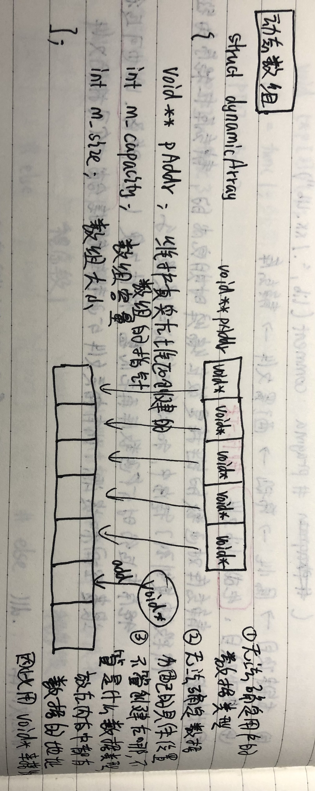

# 动态数组

#### 分文件编写
只需将 **'dynamicArray.h'** 和 **'dynamicArray.c'** 文件拷走，即可使用自己编写的动态数组。
```C
<<dynamicAray.h>>

#pragma once
#define _CRT_SECURE_NO_WARNINGS
#include<stdio.h>
#include<string.h>
#include<stdlib.h>


//动态数组结构体
struct dynamicArray
{
	void** pAddr;	//维护真实在堆区创建的指针
	int m_capacity;	//数组容量
	int m_size;		//数组大小
};

//初始化数组
struct dynamicArray* init_DynamicArray(int capacity);

//插入数组
void insert_dynamicArray(struct dynamicArray* array, int pos, void* data);

//遍历数组
void foreach_DynamicArray(struct dynamicArray* array, void(*myPrint)(void*));

//删除数组 按位置删除
void removeByPos_DynamicArray(struct dynamicArray* array, int pos);

//删除数组 按值删除
void removeByValue_DynamicArray(struct dynamicArray* array, void* data, int (*myCompare)(void* data1, void* data2));

//销毁数组 释放堆区
void destroy_DynamicArray(struct dynamicArray* array);


<<dynamicArray.c>>

#include "dynamicArray.h"
//初始化数组
struct dynamicArray* init_DynamicArray(int capacity)
{
	if (capacity <= 0)
		return NULL;
	//给数组分配空间
	struct dynamicArray* array = malloc(sizeof(struct dynamicArray));
	if (array == NULL)
		return NULL;
	array->pAddr = malloc(sizeof(void*) * capacity);
	array->m_capacity = capacity;
	array->m_size = 0;

	return array;
}

//插入数组
void insert_dynamicArray(struct dynamicArray* array, int pos, void* data)
{
	if (array == NULL)
		return;
	if (data == NULL)
		return;

	//无效位置进行尾插
	if (pos<0 || pos>array->m_size)
	{
		pos = array->m_size;
	}
	//判断数组是否满了，如果满了，进行动态扩展
	if (array->m_size == array->m_capacity)
	{
		//1、申请更大的内存空间
		int newCapacity = array->m_capacity * 2;
		//2、创建新空间
		void** newSpace = malloc(sizeof(void*) * newCapacity);
		//3、将原有数据拷贝到新空间下
		memcpy(newSpace, array->pAddr, sizeof(void*) * array->m_capacity);
		//4、释放原有的内存空间
		free(array->pAddr);
		//5、更新新空间的指向
		array->pAddr = newSpace;
		//6、更新新的容量
		array->m_capacity = newCapacity;
	}
	//不管数组是否满，都要插入新数据
	//移动元素，进行插入
	for (int i = array->m_size - 1; i >= pos; i--)
	{
		//数据向后移动
		array->pAddr[i + 1] = array->pAddr[i];
	}
	//将新元素插入到指定的位置
	array->pAddr[pos] = data;
	//更新数组大小
	array->m_size++;
}

//遍历数组
void foreach_DynamicArray(struct dynamicArray* array, void(*myPrint)(void*))
{
	if (array == NULL)
		return;
	if (myPrint == NULL)
		return;
	for (int i = 0; i < array->m_size; i++)
	{
		myPrint(array->pAddr[i]);
	}
}

//删除数组 按位置删除
void removeByPos_DynamicArray(struct dynamicArray* array, int pos)
{
	if (array == NULL)
		return;
	if (pos<0 || pos>array->m_size-1)
		return;
	//数据前移
	for (int i = pos; i < array->m_size - 1; i++)
	{
		array->pAddr[i] = array->pAddr[i + 1];
	}
	//更新数组大小
	array->m_size--;
}

//删除数组 按值删除
void removeByValue_DynamicArray(struct dynamicArray* array, void* data, int (*myCompare)(void* data1, void* data2))
{
	if (array == NULL)
		return;
	if (data == NULL)
		return;
	for (int i = 0; i < array->m_size; i++)
	{
		if (myCompare(array->pAddr[i], data))
		{
			//如果找到要删除的数据，i就是要删除的位置
			removeByPos_DynamicArray(array, i);
			break;
		}
	}
}

//销毁数组 释放堆区
void destroy_DynamicArray(struct dynamicArray* array)
{
	if (array == NULL)
		return;
	if (array->pAddr != NULL)
	{
		free(array->pAddr);
		array->pAddr == NULL;
	}
	free(array);
	array = NULL;
}

#define _CRT_SECURE_NO_WARNINGS
#include<stdio.h>
#include<string.h>
#include<stdlib.h>
#include "dynamicArray.h"


<<用户自己编写的测试文件>>
//测试
//自定义数据类型
struct Person
{
	char name[64];
	int age;
};

//自己提供 打印用户自己知道的数据 的函数
void myPrintPerson(void* data)
{
	struct Person* p = data;
	printf("姓名：%s  年龄：%d\n", p->name, p->age);
}

//自己比较自己知道什么类型的数据是否相等
int myComparePerson(void* data1, void* data2)
{
	struct Person* p1 = data1;
	struct Person* p2 = data2;
	return strcmp(p1->name, p2->name) == 0 && p1->age == p2->age;
}

int main(void)
{
	//初始化动态数组
	struct dynamicArray* array = init_DynamicArray(5);
	printf("初始化后---容量：%d  大小：%d\n", array->m_capacity, array->m_size);
	printf("---------------------------------------\n");

	//准备数据
	struct Person p1 = { "ddy", 25 };
	struct Person p2 = { "tcs", 24 };
	struct Person p3 = { "qyp", 26 };
	struct Person p4 = { "lsr", 25 };
	struct Person p5 = { "ly", 26 };
	struct Person p6 = { "jqc", 26 };

	//插入数据
	insert_dynamicArray(array, 0, &p1);
	insert_dynamicArray(array, 0, &p2);
	insert_dynamicArray(array, 1, &p3);
	insert_dynamicArray(array, 0, &p4);
	insert_dynamicArray(array, -1, &p5);
	insert_dynamicArray(array, 2, &p6);
	//lsr tcs jqc qyp ddy ly

	//遍历数据
	foreach_DynamicArray(array, myPrintPerson);
	printf("插入数据后---容量：%d  大小：%d\n", array->m_capacity, array->m_size);
	printf("---------------------------------------\n");

	//测试删除
	//按位置删除
	removeByPos_DynamicArray(array, 2);
	foreach_DynamicArray(array, myPrintPerson);
	printf("删除某个数据后---容量：%d  大小：%d\n", array->m_capacity, array->m_size);
	printf("---------------------------------------\n");

	//按值删除
	struct Person p = { "qyp",26 };
	removeByValue_DynamicArray(array, &p, myComparePerson);
	foreach_DynamicArray(array, myPrintPerson);
	printf("删除某个数据后---容量：%d  大小：%d\n", array->m_capacity, array->m_size);
	printf("---------------------------------------\n");

	//销毁数组
	destroy_DynamicArray(array);
	array = NULL;

	system("pause");
	return EXIT_SUCCESS;
}
```