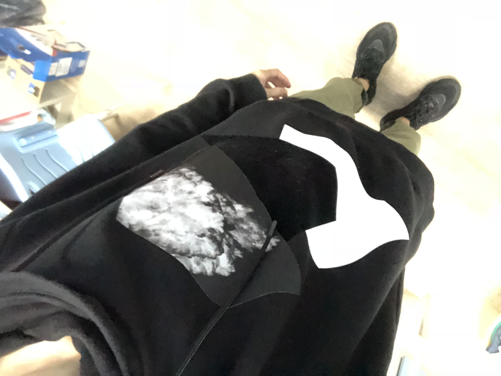

厚德 笃学 崇实 尚新

<table border="0">
  <tr>
    <td width="75%">
      <h1>段德宇</h1>
      
<b>学历：硕士</b>

      
<b>研究生：合肥工业大学机械工程学院</b>

      
<b>本科：合肥工业大学机械工程学院</b>

      
<b>邮箱：1843723137@qq.com</b>

      
<b>职位：目前就职于中兴通讯-嵌入式软件开发</b>

    </td>
    <td width="25%">
    
    </td>
  </tr>
</table>

## [**简历预览**](/段德宇嵌入式简历.pdf)  

# **编程学习之路分享**

## C

## 数据库  
+ ### [dynamicArray(动态数组)](/database/dynamicArray.md)

## C++
+ ### [cpp基础-1](/cpp/cpp基础-1.md)
+ ### [cpp基础-2](/cpp/cpp基础-2.md)
+ ### [cpp基础-3](/cpp/cpp基础-3.md)
+ ### [cpp基础-4](/cpp/cpp基础-4.md)
+ ### [cpp基础-5](/cpp/cpp基础-5.md)

## labuladong的算法小抄

  
点击展开内容  

  <a href="/文件名">程序员努力建设中</a>

  

## LeetCode题库

  
点击展开内容  

  <a href="/文件名">程序员努力建设中</a>

  

## Vscode

+ ### [vscode安装](/vscode_install.pdf)

## 计算机相关知识
+ ### [计算机如何发送数据？](/计算机相关知识/计算机数据如何发送.md)
+ ### [分组交换、电路交换和报文交换](/计算机相关知识/分组交换和电路交换.md)

## 深入理解计算机系统
+ ### [计算机系统漫游](/深入理解计算机系统/计算机系统漫游.md)
+ ### [信息的表示和处理](/深入理解计算机系统/信息的表示和处理.md)

## linux
+ ### [vim](/linux/vim.md)
+ ### [linux常用命令](/linux/command.md)
+ ### [初步认识shell](/linux/shell.md)
+ ### [makefile](/linux/makefile.md)
+ ### [进程和线程](/linux/process_and_thread.md)
+ ### [gdb调试](/linux/gdb.md)
