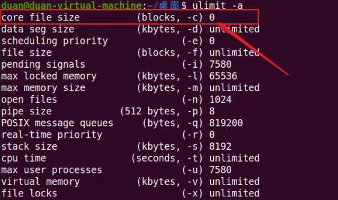
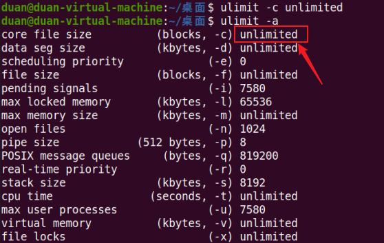
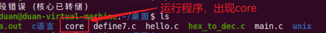
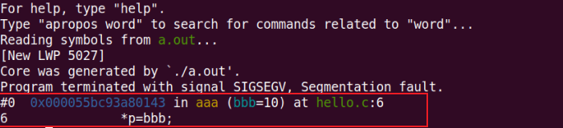
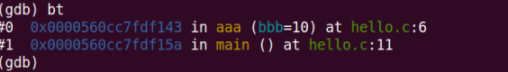
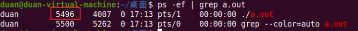

# gdb(The GNU Project Debugger)
linux下的程序调试工具
## gdb的安装
执行下列命令，如果没安装，则进行安装；如果安装过，则进行更新  
1、Centos下：
```c
sudo yum -y install gdb
```
2、ubuntu下：
```c
sudo apt-get install gdb
```

## gdb调试
用gcc编译源程序的时候，编译后的可执行文件不会包含源程序代码，如果您打算编译后的程序可以被调试，编译的时候要加 -g 的参数  
例如：
```c
gcc -g xxx.c -o xxx
gdb xxx
```

## 基本调试命令

命令 | 命令缩写 | 命令说明
:-: | :-: | :-:
break | b | 设置断点<br>b 20 表示在第20行设置断点<br>可以设置多个断点
run | r | 开始运行程序, 程序运行到断点的位置会停下来<br>如果没有遇到断点，程序一直运行下去
next | n | 执行当前行语句<br>如果该语句为函数调用，不会进入函数内部执行
print | p | 显示变量值<br>p name表示显示变量name的值<br>p 后面也可以接表达式
continue | c | 继续程序的运行，直到遇到下一个断点
list | l | 查看文件代码
quit | q | 退出gdb环境
set var name=value |  | 设置变量的值<br>假设程序有两个变量：int ii; char name[21];<br>set var ii=10 把ii的值设置为10；<br>set var name="西施" 把name的值设置为"西施"，注意，不是strcpy。
set args |  | 设置主程序的参数<br>例如：./xxx a b<br>(gdb) set args a b<br>p argc p argv[0] p argv[1]打印
step | s | 	执行当前行语句，如果该语句为函数调用，则进入函数，执行该函数的第一条语句<br>注意，如果函数是库函数或第三方提供的函数，用s也是进不去的，因为没有源代码<br>如果是您自定义的函数，只要有源码就可以进去。

如果参数里面包括特殊字符，则需要将参数用双引号 "" 括起来

## segment fault(core dump)段错误(核心已转储)

操作非法地址之后，系统会生成 core 文件  
segment fault产生的原因：  
1. 坏指针错误：在指针赋值之前就用它来引用内存
2. 改写错误：越过数组边界写入数据，在动态分配的内存空间以外写入数据，或改写一些堆管理数据结构
3. 指针释放引起的错误 ：释放同一块内存两次，或释放一块未曾使用 malloc 分类的内存，或释放一个无效的指针

程序挂掉的时，系统缺省不会生成 core 文件  
1) gcc -g xxx.c  
2) ./a.out  


3) ulimit -a 查看系统参数；  


4) ulimit -c unlimit 把 core 文件的大小设为无限制；  


5) 运行程序，生成 core 文件；  


6) gdb 程序名 core文件名  


7) 输入 bt，可查看函数调用栈  


## 调试正在运行的程序
如果程序进入了死循环，一直运行，那么重新打开一个终端，先查看当前的进程pid
```c
ps -ef | grep a.out
gdb a.out -p pid
```


## 调试多进程
