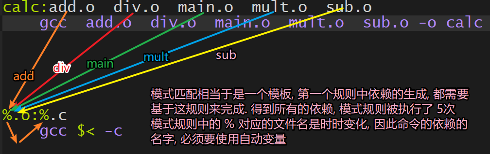

## makefile
使用 gcc 的命令进行程序编译时，对于单个文件或者同一路径下的少数文件编译是比较方便的，但是对项目中有很多文件，甚至这些文件不在同一个文件夹下，则必须使用 make 。  
make 是一个命令工具，是一个解释 makefile 中指令的命令工具，而 makefile 就像一个 Shell 脚本一样， 里面定义了一系列的规则来指定哪些文件需要先编译，哪些文件需要后编译。  
若当前目录下有写好的 makefile ，则直接在当前目录下运行 make 即可。  
**如果 gcc -c xx.c -o xx.o , 则 -c 选项一定不能省略**

### 1 规则
```makefile
# 每条规则的语法格式:
target1,target2...: depend1, depend2, ...
	command
	......
	......
# 在 makefile 中声明一个伪目标需要使用 .PHONY 关键字
.PHONY:伪文件名称
# 伪目标：执行下面命令时没有生成目标文件
```
每条规则由三个部分组成分别是目标文件(target), 依赖文件(depend) 和命令(command)。  
+ 命令(command): 当前这条规则的动作，一般情况下这个动作就是一个 shell 命令
  - 例如：通过 gcc 编译文件;
  - 动作可以是多个，每个命令前必须有一个Tab缩进并且独占占一行。

+ 依赖(depend): 规则所必需的依赖条件，在规则的命令中可以使用这些依赖

+ 目标(target)：规则中的目标，这个目标和规则中的命令是对应的
  - 通过执行规则中的命令，可以生成一个和目标同名的文件
  - 规则中可以有多个命令，因此可以通过这多条命令来生成多个目标，所有目标也可以有很多个
  - 通过执行规则中的命令，可以只执行一个动作，不生成任何文件，这样的目标被称为伪目标

```makefile
# 举例: 有源文件 a.c b.c c.c d.c head.h, 需要生成可执行文件 test
################# 例1 #################
test:a.c b.c c.c
	gcc a.c b.c c.c -o test

################# 例2 #################
# 有多个目标, 多个依赖, 多个命令
test,test1:a.c b.c c.c d.c
	gcc a.c b.c -o test
	gcc c.c d.c -o test1
	
################# 例3 #################	
# 规则之间的嵌套
test:a.o b.o c.o
	gcc a.o b.o c.o -o test
a.o:a.c
	gcc -c a.c -o a.o
b.o:b.c
	gcc -c b.c -o b.o
c.o:c.c
	gcc -c c.c -o c.o
```

### 2 工作原理
#### 2.1 规则的执行
make 会首先找到 makefile 文件中的第 1 个规则，分析并执行相相应的指令。如果使用的依赖不存在，那么这个动作就不会被执行。必须先将需要的依赖生成出来——可以在第一个规则下面添加新的规则，将所需的依赖作为这个新的规则中的目标，如上面例三。  
当规则 1 中依赖全部被生成之后对应的命令也就被执行了，因此规则 1 的目标被生成，make 工作结束。

#### 2.2 文件时间戳
目标时间戳 > 所有依赖的时间戳
- 目标是通过依赖生成的，如果执行 make 命令的时候检测到规则中的目标和依赖满足这个条件，那么规则中的命令就不会被执行。

目标时间戳 < 某些依赖的时间戳
- 当依赖文件被更新了，文件时间戳也会随之被更新，这种情况下目标文件会通过规则中的命令被重新生成。

如果规则中的目标对应的文件根本就不存在， 那么规则中的命令肯定会被执行。

#### 2.3 自动推导
```makefile
calc:add.o div.o main.o mult.o sub.o
	gcc add.o div.o main.o mult.o sub.o -o calc
```

```makefile
$ make
cc    -c -o add.o add.c
cc    -c -o div.o div.c
cc    -c -o main.o main.c
cc    -c -o mult.o mult.c
cc    -c -o sub.o sub.c
gcc add.o div.o main.o mult.o sub.o -o calc
```
我们可以发现上边的 makefile 文件中只有一条规则，依赖中所有的 .o 文件在本地项目目录中是不存在的，并且也没有其他的规则用来生成这些依赖文件，这时候 make 会使用内部默认的构造规则先将这些依赖文件生成出来，然后在执行规则中的命令，最后生成目标文件 calc。

### 3 变量
上述例3的程序重复的很多，若文件很多，则必须要写出很多重复的语句，显得很冗余，所以，要采用 makefile 中的变量优化。
#### 3.1 自定义变量
```makefile
# 正确, 创建一个变量名并且给其赋值
变量名=变量值
# 查看变量的值
$(变量名)

# 定义变量并赋值
obj=add.o div.o main.o mult.o sub.o
# 取变量的值
$(obj)
```
```makefile
# 这是一个规则，里边使用了自定义变量
obj=add.o div.o main.o mult.o sub.o
target=calc
$(target):$(obj)
        gcc $(obj) -o $(target)
```

#### 3.2 预定义变量
变 量 名 | 含 义 |默 认 值  
:-: | :-: | :-:    
CC | C 语言编译器的名称 | cc  
CXX | C++ 语言编译器的名称 | g++  
RM | 删除文件程序的名称 | rm -f  
CFLAGS | C 语言编译器的编译选项 | 无默认值  

```makefile
# 这是一个规则，普通写法
calc:add.o div.o main.o mult.o sub.o
    gcc add.o div.o main.o mult.o sub.o -o calc
        
# 这是一个规则，里边使用了自定义变量和预定义变量
obj=add.o div.o main.o mult.o sub.o
target=calc
CFLAGS=-O3 # 代码优化
$(target):$(obj)
        $(CC) $(obj) -o $(target) $(CFLAGS)
```
#### 3.3 自动变量
自动变量用来代表这些规则中的目标文件和依赖文件，并且它们**只能在规则的命令中使用**。  
变量 | 含义  
:-: | :-:  
$< | 表示依赖项中第一个依赖文件的名称  
$@ | 表示目标文件的名称，包含文件扩展名  
$^ | 依赖项中，所有不重复的依赖文件，这些文件之间以空格分开  
$* | 表示目标文件的名称，不包含目标文件的扩展名  

```makefile
# 这是一个规则，普通写法
calc:add.o div.o main.o mult.o sub.o
    gcc add.o div.o main.o mult.o sub.o -o calc
        
# 这是一个规则，使用自动变量
calc:add.o div.o main.o mult.o sub.o
	gcc $^ -o $@
```

### 4 模式匹配
还是以例3为例，从第二个规则开始到第四个规则做的是相同的事情，但是由于文件名不同不得不在文件中写出多个规则，这就让 makefile 文件看起来非常的冗余，我们可以将这一系列的相同操作整理成一个模板
```makefile
# 表示任意的 .c 和 .o 文件
%.c, %.o

# 表示所有的 .c 和 .o 文件
*.c, *.o
```

```makefile
a.o:a.c
	gcc -c a.c -o a.o
b.o:b.c
	gcc -c b.c -o b.o
c.o:c.c
	gcc -c c.c -o c.o

# 简写后
%.c: %.o
	gcc $< -c $@
```


### 5 函数
makefile 中有很多函数并且**所有的函数都是有返回值的**。makefile 中函数的格式： **$(函数名 参数1, 参数2, 参数3, ...)**，主要目的是让我们能够快速方便的得到函数的返回值。

#### 5.1 wildcard

获取指定目录下指定类型的文件名，其返回值是以空格分割的、指定目录下的所有符合条件的文件名列表
```makefile
# 该函数的参数只有一个, 但是这个参数可以分成若干个部分, 通过空格间隔
$(wildcard PATTERN...)
# 参数:	指定某个目录, 搜索这个路径下指定类型的文件，比如： *.c
# 返回值：得到的若干个文件的文件列表， 文件名之间使用空格间隔
# 例如
src=$(wildcard /home/duan/*.c *.c)
# 返回值格式: 
/home/duan/aa.c /home/duan/bb.c a.c b.c c.c
```

#### 5.2 patsubst
按照指定的模式替换指定的文件名的后缀
```makefile
# 有三个参数, 参数之间使用逗号间隔
$(patsubst <pattern>,<replacement>,<text>)
# 参数功能:
pattern: 这是一个模式字符串，需要指定出要被替换的文件名中的后缀是什么, 比如: %.c, 意味着 .c 的后缀要被替换掉
replacement: 这是一个模式字符串，指定参数 pattern 中的后缀最终要被替换为什么, 比如: %.o 这表示原来的后缀被替换为 .o
text: 该参数中存储这要被替换的原始数据
# 返回值:
函数返回被替换过后的字符串
```
```makefile
src = a.cpp b.cpp c.cpp e.cpp
# 把变量 src 中的所有文件名的后缀从 .cpp 替换为 .o
obj = $(patsubst %.cpp, %.o, $(src)) 
# obj 的值为: a.o b.o c.o e.o
```

### 6 makefile 练习
#### 6.1 版本1
```makefile
calc:add.c div.c main.c mult.c sub.c
    gcc add.c div.c main.c mult.c sub.c -o calc
# 优点：书写简单
# 缺点：只要依赖中的某一个源文件被修改，所有的源文件都需要被重新编译，太耗时、效率低
```
#### 6.2 版本2
```makefile
# 默认所有的依赖都不存在, 需要使用其他规则生成这些依赖
calc:add.o div.o main.o mult.o sub.o
    gcc add.o div.o main.o mult.o sub.o -o calc

add.o:add.c
    gcc -c add.c -o add.o

div.o:div.c
    gcc -c div.c -o div.o

main.o:main.c
    gcc -c main.c -o main.o

sub.o:sub.c
    gcc -c sub.c -o sub.o

mult.o:mult.c
    gcc -c mult.c -o mult.o

# 优点：相较于版本 1 效率提升了
# 缺点：规则比较冗余，需要精简
```
#### 6.3 版本3
```makefile
# 添加自定义变量
obj=add.o div.o main.o mult.o sub.o
tar=calc
$(tar):$(obj)
        gcc $(obj) -o $(tar)

%.o:%.c
        gcc -c $< -o $@
# 优点：文件精简不少，变得简洁了
# 缺点：变量 obj 的值需要手动的写出来，如果需要编译的项目文件很多，都用手写出来不现实
```
#### 6.4 版本4
```makefile
# 使用函数搜索当前目录下的源文件 .c
src=$(wildcard *.c)
# 将源文件的后缀替换为 .o
obj=$(patsubst %.c, %.o, $(src))
tar=calc
$(tar):$(obj)
    gcc $(obj) -o $(tar)

%.o:%.c
    gcc -c $< -o $@

# 优点：解决了自动加载项目文件的问题，解放了双手
# 缺点：没有文件删除的功能，不能删除项目编译过程中生成的目标文件（*.o）和可执行程序
```
#### 6.5 版本5
```makefile
src=$(wildcard *.c)
obj=$(patsubst %.c, %.o, $(src))
tar=calc
$(tar):$(obj)
    gcc $(obj) -o $(tar)

%.o:%.c
    gcc -c $< -o $@

# 这个规则比较特殊, clean根本不会生成, 这是一个伪目标
clean:
    rm -rf $(obj) $(tar)

# 优点：添加了新的规则用于文件的删除，直接 make clean 就可以执行规则中的删除命令了
# 缺点：clean 会和文件夹下的文件名重名，这种情况下，由于没有依赖文件，所以 clean 永远是最新的文件，所以不会运行
```
#### 6.6 版本6（最终版）
```makefile
src=$(wildcard *.c)
obj=$(patsubst %.c, %.o, $(src))
tar=calc
$(tar):$(obj)
    gcc $(obj) -o $(tar)

%.o:%.c
    gcc -c $< -o $@

# 添加规则, 删除生成文件 *.o 可执行程序
# 声明clean为伪文件
.PHONY:clean
clean:
    # - 表示强制这个指令执行, 如果执行失败也不会终止；如果不加，若命令执行失败，echo 语句是不会执行的
    -rm $(obj) $(target) 
    echo "hello, 我是测试字符串"
```

### 7 进阶题
```makefile
# 目录结构
.
├── include
│   └── head.h	==> 头文件, 声明了加减乘除四个函数
├── main.c		==> 测试程序, 调用了head.h中的函数
└── src
    ├── add.c	==> 加法运算
    ├── div.c	==> 除法运算
    ├── mult.c  ==> 乘法运算
    └── sub.c   ==> 减法运算
# 根据上边的项目目录结构编写的 makefile 文件如下:

# 最终的目标名 app
tar = app
# 搜索当前项目目录下的源文件
src=$(wildcard *.c ./src/*.c)
# 将文件的后缀替换掉 .c -> .o
obj=$(patsubst %.c, %.o, $(src))
# 头文件目录
include=./include

# 第一条规则
# 依赖中都是 xx.o yy.o zz.o
# gcc命令执行的是链接操作
$(tar):$(obj)
    gcc $^ -o $@

# 模式匹配规则
# 执行汇编操作, 前两步: 预处理, 编译是自动完成
%.o:%.c
    gcc -c $< -o $@ -I $(include)
    # -I 要制定搜索头文件的目录

# 添加一个清除文件的规则
.PHONY:clean
clean:
    rm -rf $(obj) $(tar)
```
