# 前言
所谓分组，就是将一个数据包分成一个个更小的数据包。例如对于一个10GB的数据包，总不可以一次性发送过去吧，而是把它分成若干个小的数据包发送过去。每个分组数据块都类似于下图：  
  
文件头一般是一些说明性数据，例如源地址和目标地址等。数据部分就是真正要传达给对象的内容。  
所谓交换，指的就是服务器与服务器之间的数据交换。数据传输交换的方式有电路交换、分组交换和报文交换。
## 电路交换
假如A和E之间要进行通信，我们就假设A要和E打个电话吧。当A输入E的电话号码，开始拨号之后，那么服务器要做的第一件事就是根据E的电话号码找到E在哪里，由于A通往E的路径有多条，会根据某种算法找到E之后，建立一条通路，然后进行数据的传输。我们假设选的路径是A→D→E。  

找到一条通往E的路径并建立会话的过程中，我们称之为电路交换的**第一阶段———建立连接**。之后A和E在通话的过程中会始终占着这条路径，数据传输的过程称为电路交换的**第二阶段————数据传输**。电路交换的第三阶段，也就是最后一个阶段————**释放连接**。A和B只要有一方挂了电话，那便了开始释放连接。  
在电话交换的过程中，数据是不需要分组来传送的，因为电话交换的过程中，A和B两个人始终占着一条通信电路，他们每说一句话，都会实时被对方获取，因此数据是不用分组的。  
从这也可以看出，电路交换的方式，在数据的传输上是比较高效、实时的，只要A一发出数据，E立马就能收到了,这也是为什么我们的电话通信使用的是电路交换的方式。但由于双方一直占着这条路径，假如A与E都在沉默不说话，那么将是对这条路径的极大浪费。因此，电路连接的方式资源的利用率是比较低的。此外，如果你通话的时间超级短，可能花在新建连接的时间比通话的时间还要长，这就更加难受了。

电路连接的三个阶段：
1. 建立连接  
2. 数据传输  
3. 释放连接
>优点：
>>1 传输速度快、高效
>>2 实时

>缺点：
>>1 资源利用率低
>>2 新建连接需要占据一定的时间，甚至比通话的时间还长

## 分组交换
分组交换这种方式数据包是分组成更小的数据包进行传输的。分组交换的数据传输过程和电路交换不一样，分组交换采取**存储转发传输**的机制。还是以A给E传输数据作为例子来讲解。  
假如A要给E发送一个数据包P，但这个数据包有点大，需要分成三组p1,p2,p3三个更小的数据包。这时A给E传输数据不需要新建连接这个过程，即不需要寻找一个通往E的路径。而且A直接把小的数据包丢给附近的路由器，然后A就不管了，例如A把p1丢给了B，这个时候A就不在去管p1了，当B收到p1这个完整的小数据包之后，B再丢给E。  
但是A不一定都会把剩下的数据包都丢给B，有可能会把其他的数据包p2丢给C,之后再把p3丢给D，然后C和D在转发丢给E。这些都是不确定的，会根据某种算法的选择路由器。此外，B必须收到完整的p1数据包后才能进行转发，因为p1数据包包含E的地址，如果不是完整的数据包，B也不知道该发给谁。  

  

从分组交换的机制可以发现一些问题：由于A把数据包丢给B之后就不管了，那B什么时候会把p1转发出去？而且可能B会绕一大圈再发给E也是有可能的。因为**分组交换的机制在数据传输方面不具有实时性**。而且，很有可能会有很多路由器把数据包丢给B，这个时候就会造成**通信阻塞**，这时可能p1只能排队等待B来发送。由于B路由器的容量是有限的，如果有太多的数据包丢给它，它可能会容纳不下，这时候就可能会出现**丢包**的情况。又或者，由于p1,p2,p3数据包都有文件头，里面都包含了A和E的一些信息，当然还有其他的信息。可以说这些文件头有很多重复的数据，因此分组交换发送的数据具有很多的重复无用数据。另外，分组交换还包括时延的缺点，因为B必须收到一个完整的p1才能把p1转发出去，因为这个接受存储的过程中存在时延，这种时延也成为传输时延，当然还存在传播时延和处理时延等。所谓处理时延就是每次都得检查这个数据包的文件头和决定将该数据包传输给谁。

>缺点：
>>1、不具有实时性
>>2、存在延时
>>会造成通信阻塞
>>存在无用的重复数据
>>会出现丢包的情况
>优点：
>>1、设计简单
>>2、资源利用率很高

## 报文交换
报文交换就是一整个数据包存储转发的，不过这种方式使用的比较少。

## 应用实例
两种交换传输的特点决定了我们平时的电话通信使用的是电路交换。  
比如微信等，这种不要求实时的通信用分组交换，有时你发个信息，可能网络不好的话，或者太多人在同时使用的话，可能你的信息要过一阵子对方才能收到。但如果有急事的话，需要实时传播，所以打电话需要用电路交换。