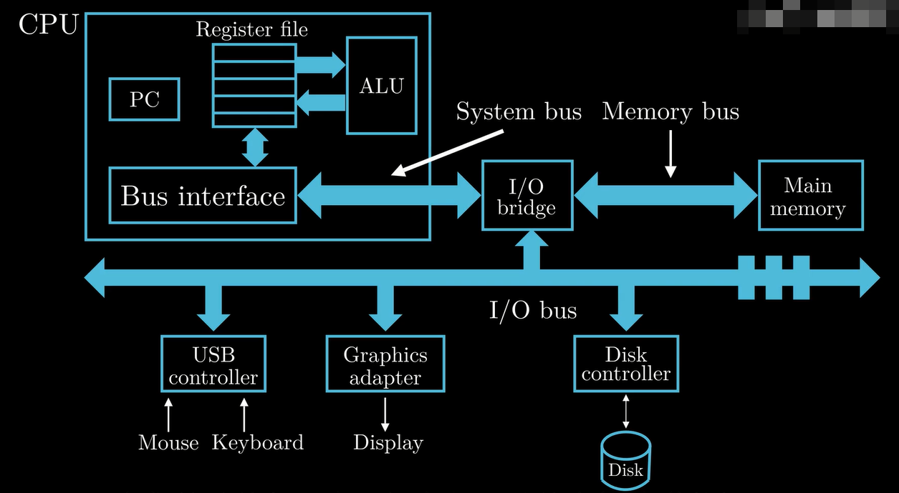
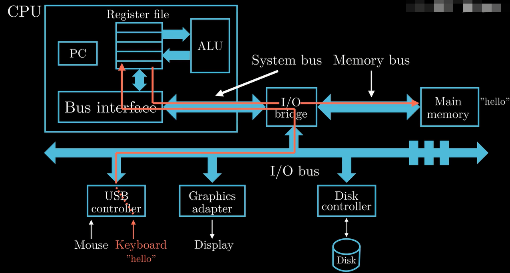
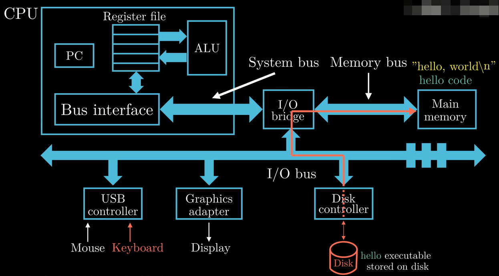
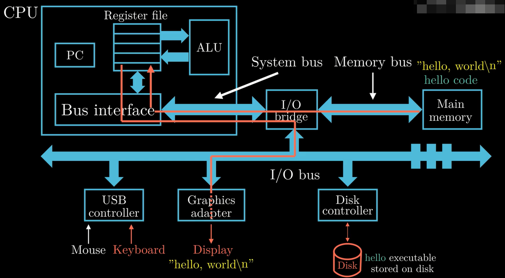
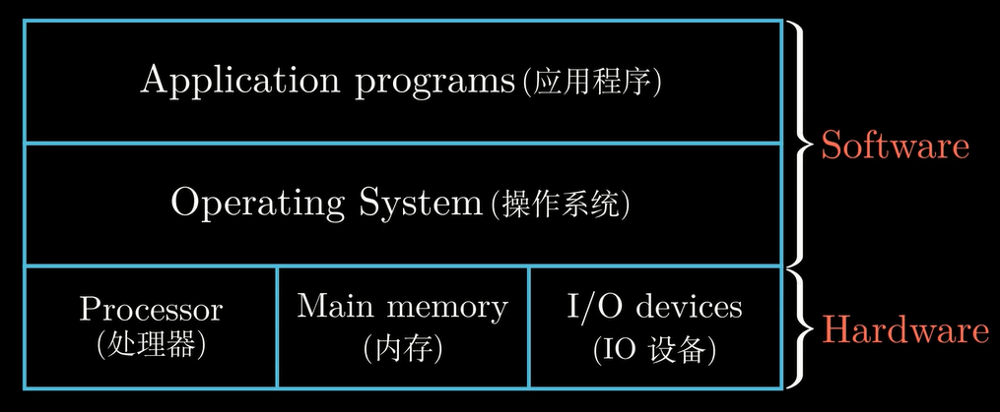
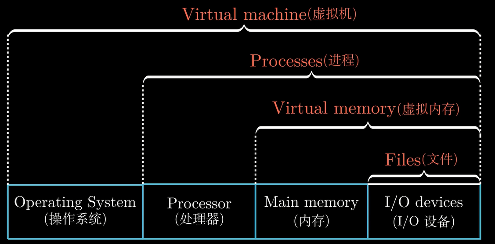
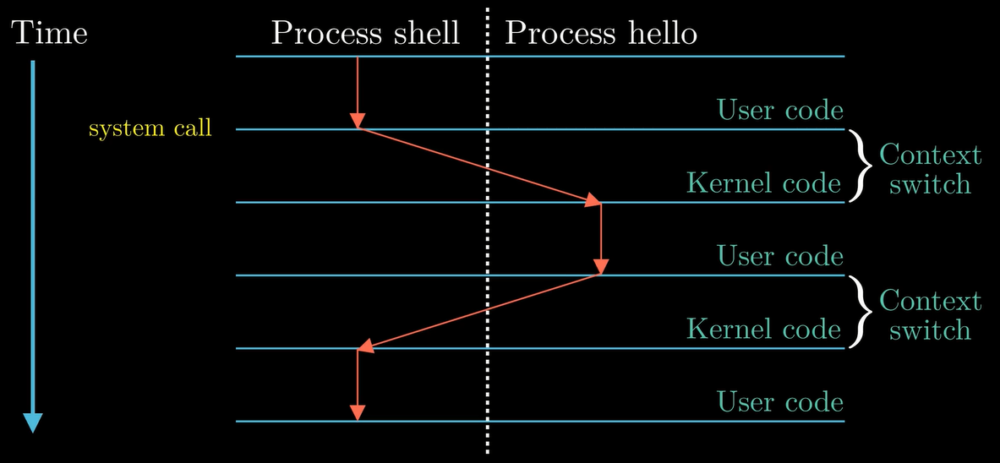
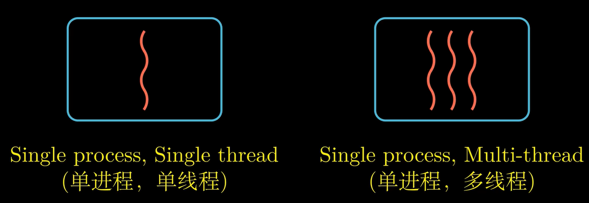
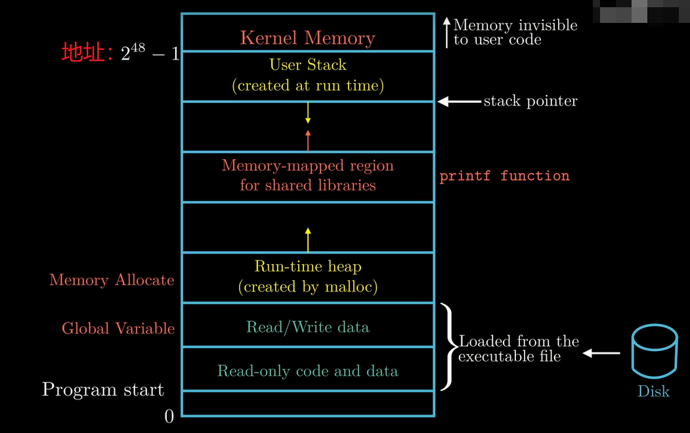
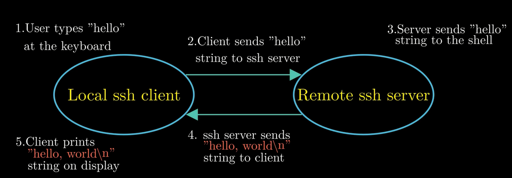

# 1 计算机系统漫游
以"helloworld"程序的生命周期为线索，对计算机系统的主要概念做了一个整体的介绍
```C
"hello.c"
#include <stdio.h>
int main()
{
    printf("hello,world\n");
    return 0;
}
```
## **1.1 gcc 编译过程**
linux -> gcc hello.c -o hello, 生成可执行文件 hello ，如果不加 -o hello，gcc 会默认生成 a.out 的可执行文件，linux-> ./hello 即可看到打印出来的内容，具体执行如下：

预处理：把 .h, .c 文件展开形成一个 .i 文件 "宏定义展开 头文件展开 条件编译 去掉注释" 
```C
gcc -E hello.c -o hello.i
```
编译：.i 文件生成一个汇编代码文件 .s "检查语法"
```C
gcc -S hello.i -o hello.s
```
汇编：.s 文件生成一个 .o 文件---二进制文件
```C
dcc -c hello.s -o hello.o
```
链接：对 .o 文件进行链接，并将C语言依赖库链接到程序中
```C
gcc hello.o -o hello
```
## **1.2 为什么要学习这个?**
面试过程中会问到：
+ 一个 switch 是不是要比一连串的 if-else 要高效的多？
+ 一个函数调用的开销有多大？
+ while 循环比 for 循环更高效么？  

理解链接过程中出现的错误
+ 静态变量和全局变量的区别是什么？
+ 静态库和动态库的区别是什么？  

避免安全漏洞
+ 缓冲区溢出问题---互联网的安全漏洞

## **1.3 计算机的硬件组成**

1. CPU(Central Processing Unit)处理器
+ PC(Program Count)---大小为一个字的存储空间，存放的是某一条指令的地址；32位：1 word = 4 Byte，64位：1 word = 8 Byte
+ 寄存器文件，由寄存器组成（一个临时存放数据的空间）
+ 逻辑单元ALU(Arithmatic/Logic Unit)
2. 主存(内存)：处理器在执行程序时，内存主要存放程序指令以及程序处理的数据。物理上讲，内存是由一组动态随机存储器(DRAM)芯片组成；从逻辑上讲，内存是一个线性的**字节数组**，每个字节都有其唯一的地址，这些地址是从0开始的。
3. 总线(I/O bridge)，贯穿整个系统的电子管道，负责将信息从一个部件传递到另一个部件，总线通常被设定成传送定长的**字**
4. I/O设备，系统与外部设备的联系通道。分为控制器和适配器，主要区别是他们的封装方式不同。*控制器是I/O设备本身或者是系统的主印刷电路板上的芯片组；适配器是一块插在主板插槽上的卡。*

## **1.4 hello.c程序的运行流程**
+ 读取指令
  
+ 加载可执行文件到内存
  
+ 输出内容到显示器
  

## **1.5 存储设备(由读取时间从快到慢)金字塔模型**
+ 寄存器文件: 100~1000B
+ L1 cache(高速缓存)：10~100KB
+ L2 cache(高速缓存)：0.1~10MB
+ L3 cache(高速缓存)：10~100MB
+ 内存：1~100GB
+ 磁盘：1~1000TB
  
## **1.6 操作系统管理硬件**


+ 进程——操作系统对一个正在运行的程序的一种抽象。
  并发运行——一个进程的指令和另一个进程的指令是交错执行的。
  上下文——操作系统会跟踪进程运行中所需要的所有状态信息，这种状态称为上下文
  
+ 线程——一个进程实际上可以由多个称为线程的执行单元组成，每个线程都运行在进程的上下文中，并共享同样的代码和全局数据。
  
+ 虚拟内存——为每个进程提供了一个假象，即每个进程都在独占的使用主存，每个进程看到的内存都是一致的，称为虚拟地址空间。下图为linux进程的虚拟地址空间。
  
+ 文件——linux一切皆文件，每个I/O设备都为一个文件，甚至包括网络，因为他们不需要了解设备原理，只需要读取即可。
## 网络
网络可以看成一个I/O适配器

